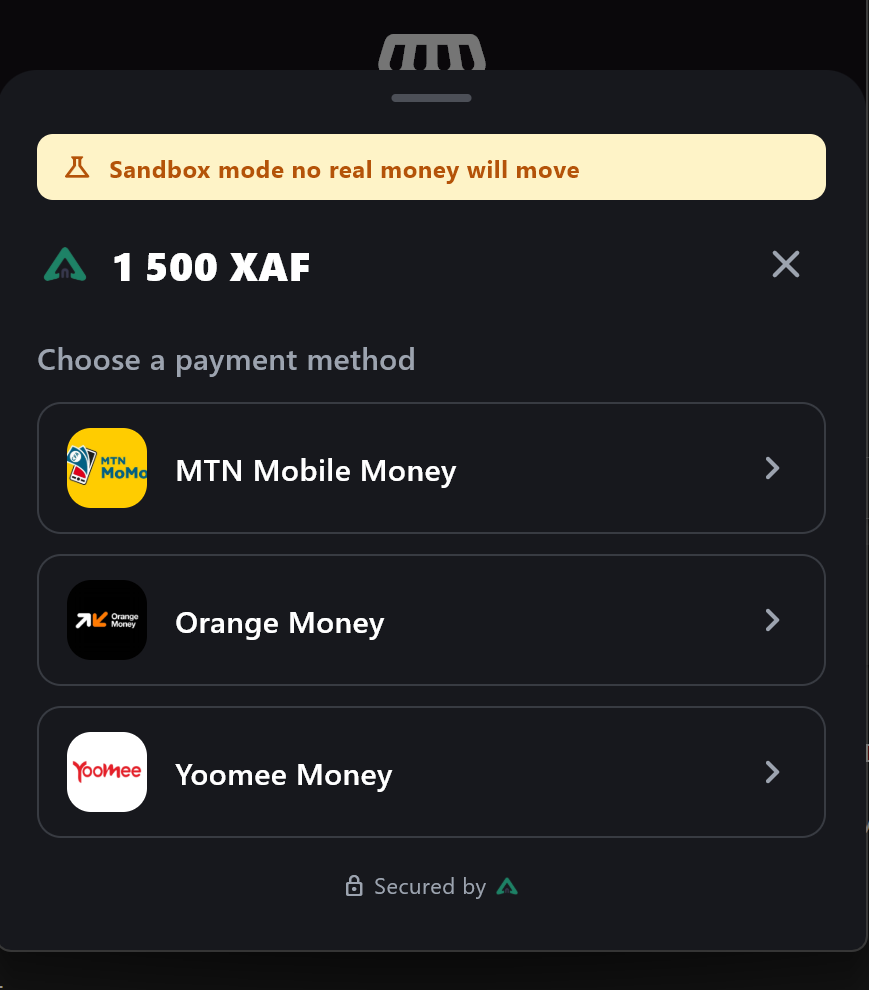
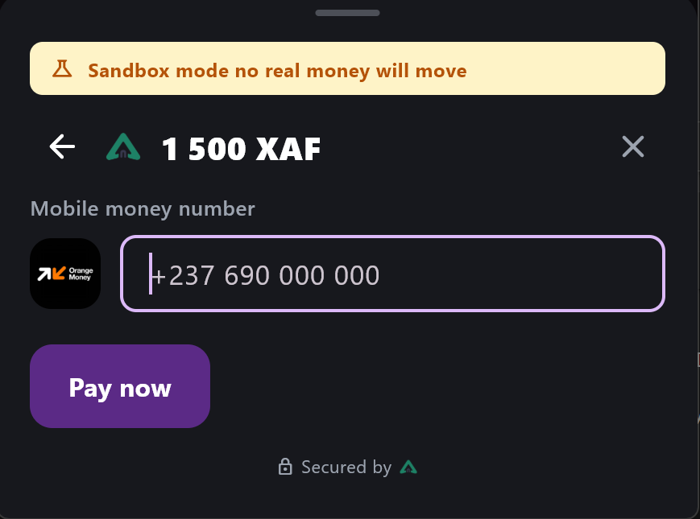
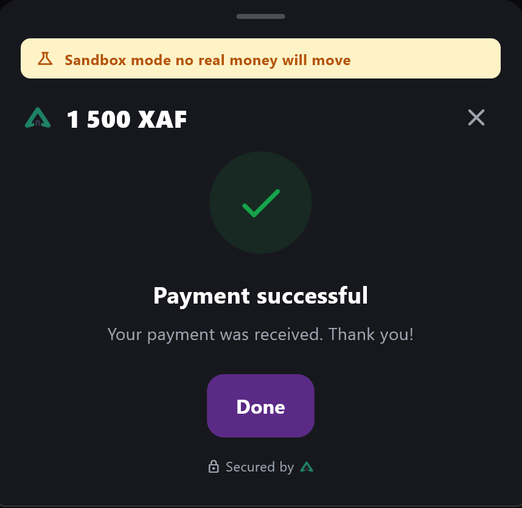

# flutter_notchpay

<p align="center">
  
</p>

[](https://github.com/BorisGautier/flutter_notchpay/actions/workflows/ci.yml)
[](https://pub.dev/packages/flutter_notchpay)
[](https://codecov.io/gh/BorisGautier/flutter_notchpay)
[](LICENSE)

A secure, complete, and beautiful Flutter SDK for [NotchPay](https://notchpay.co).
Accept Mobile Money (MTN, Orange) and Card payments in your native Flutter
app with a polished, ready-made checkout sheet — no WebView, no manual
polling loop, no PCI scope creep.

<p align="center">
  
  &nbsp;&nbsp;
  
  &nbsp;&nbsp;
  
</p>

📖 **[Read the complete usage guide](doc/USAGE.md)** for every service,
method, and model this package exposes — this README only covers the
essentials to get you started.

## Features

- **One call to checkout**: `NotchPay.instance.checkout(context, request: ...)`
  opens a themeable bottom sheet and returns a typed result
  (`success` / `cancelled` / `failed`) once the flow is done.
- **Native Mobile Money UX**: the phone field auto-detects MTN vs. Orange
  from the number as the customer types, with an animated confirmation
  screen while the SDK polls NotchPay for the final status.
- **Card & other channels**: completed through NotchPay's own secure hosted
  page (via `url_launcher`), so this package never touches raw card data.
- **Sandbox-aware**: the SDK detects, from the key itself, whether you're
  in sandbox or live mode, and shows a "Sandbox mode" banner automatically
  so nobody mistakes a test payment for a real one. See
  [Sandbox vs. live](#sandbox-vs-live-mode).
- **Full API coverage**: customers, payments, channels/currencies/countries,
  payment methods, identity lookup, and the backend-only recipients,
  transfers, refunds, balance and Connect sub-account endpoints. See the
  [full guide](doc/USAGE.md) for every method.
- **Typed errors**: `NotchPayApiException`, `NotchPayNetworkException`,
  `NotchPayConfigurationException` — never a raw `Exception`.
- **Built-in i18n**: English and French out of the box, auto-selected from
  the device locale, overridable per call.
- **Responsive & themeable**: colors, radii and typography follow your app
  by default; the sheet stays readable on phones, tablets, desktop and web
  instead of stretching edge-to-edge. Override anything via
  `NotchPayThemeData`.
- **Security-first design**: the client SDK only ever needs your **public**
  key. Private-key-only operations refuse to run without one, so you can't
  accidentally ship a secret key in your app. See [Security](#security).

## Getting your API keys

1. Sign up / log in at the [NotchPay Business dashboard](https://business.notchpay.co).
2. Go to **Settings → API Keys**. You'll see a **sandbox/test** pair and a
   **live** pair.
3. Copy the **public key** (`pk_...`) into your app — that's the only
   credential this package's `checkout()` flow ever needs.
4. Never copy the **secret key** (`sk_...`) into a mobile app; see
   [Security](#security).

Full details, including how KYC/business validation gates live mode, are in
the [usage guide](doc/USAGE.md#1-getting-your-api-keys-notchpay-dashboard).

## Getting started

```yaml
dependencies:
  flutter_notchpay: ^0.1.0
```

```dart
import 'package:flutter_notchpay/flutter_notchpay.dart';

void main() {
  NotchPay.init(publicKey: 'pk_test_xxx'); // from your NotchPay dashboard
  runApp(const MyApp());
}
```

## Usage

```dart
final result = await NotchPay.instance.checkout(
  context,
  request: const NotchPayCheckoutRequest(
    amount: 1500,
    currency: 'XAF',
    description: 'Order #4831',
    customer: NotchPayCheckoutCustomer(phone: '+237655728267'),
  ),
);

switch (result.status) {
  case NotchPayCheckoutStatus.success:
    print('Paid! reference: ${result.payment!.reference}');
  case NotchPayCheckoutStatus.cancelled:
    print('Customer closed the sheet.');
  case NotchPayCheckoutStatus.failed:
    print('Payment failed: ${result.message}');
}
```

See [`example/`](example) for a complete, runnable app — including theming,
`flutter_bloc` state management, and a local payment history cache built
with `drift` (both `flutter_bloc` and `drift` are used by the example app
only; the package itself depends on neither).

### Theming

```dart
NotchPay.instance.checkout(
  context,
  request: request,
  theme: const NotchPayThemeData(
    primaryColor: Color(0xFF0EA5E9),
    borderRadius: 28,
  ),
);
```

### Localization

The sheet picks English or French automatically from
`Localizations.localeOf(context)`. To support another language or tweak any
string:

```dart
NotchPay.instance.checkout(
  context,
  request: request,
  localizations: const NotchPayLocalizations(
    payNow: 'Payer',
    // ...every other field — see doc/USAGE.md#7-localization
  ),
);
```

### Sandbox vs. live mode

```dart
NotchPay.instance.environment; // NotchPayEnvironment.sandbox or .live
NotchPay.instance.isSandbox;   // bool
```

Detected automatically from the public key (NotchPay's own `test` marker
convention, e.g. `pk_test_...`). When sandbox is detected, `checkout()`
shows a small "Sandbox mode — no real money will move" banner at the top of
the sheet; live mode shows nothing extra. See
[Section 4 of the usage guide](doc/USAGE.md#4-sandbox-vs-live-mode) for the
exact detection rule.

## API coverage

| Resource | Methods | Key required |
| --- | --- | --- |
| `NotchPay.instance.payments` | initialize, fetch, list, complete, cancel | public |
| `NotchPay.instance.customers` | create, list, fetch, update, block, unblock, delete | public |
| `NotchPay.instance.resources` | channels, currencies, countries | public |
| `NotchPay.instance.paymentMethods` | list, fetch | public |
| `NotchPay.instance.identity` | fetch, validate | public |
| `NotchPay.instance.recipients` | list, fetch, create, delete | **private** |
| `NotchPay.instance.transfers` | initiate, direct, list, fetch | **private** |
| `NotchPay.instance.refunds` | list, fetch | **private** |
| `NotchPay.instance.balance` | fetch | **private** |
| `NotchPay.instance.sync` | list, fetch, initialize, authorize | **private** |

"Private" methods require `NotchPay(publicKey: ..., privateKey: ...)` and
are meant for trusted backend Dart code — see [Security](#security) and the
[usage guide, Section 13](doc/USAGE.md#13-backend-only-services-private-key-required)
for a worked example of each.

Every method, model, and utility (including the Cameroon phone/operator
detection, card helpers, and currency formatting) is documented with a full
example in **[doc/USAGE.md](doc/USAGE.md)**.

## Security

- **Public key only, in the app.** `NotchPay.checkout()` and every method
  under `payments`, `customers`, `resources`, `paymentMethods`, and
  `identity` only ever need the public key you pass to `NotchPay.init`.
- **Never ship your private/secret key in a mobile binary.** Methods under
  `recipients`, `transfers`, `refunds`, `balance`, and `sync` require a
  private key; without one they throw `NotchPayConfigurationException`
  instead of silently failing. Only use them from a trusted backend.
- **No raw card handling.** Card payments are completed through NotchPay's
  own hosted, PCI-compliant page, opened in a secure in-app browser tab —
  this package never collects or transmits a raw card number.
- See [SECURITY.md](SECURITY.md) for the full policy and how to report a
  vulnerability.

## Contributing

Contributions are welcome! Please read [CONTRIBUTING.md](CONTRIBUTING.md)
for the branching model (`dev` → `main`) and the checks your PR needs to
pass, and [CODE_OF_CONDUCT.md](CODE_OF_CONDUCT.md) for community
guidelines. Repository maintainers, see [`.github/SETUP.md`](.github/SETUP.md)
for one-time admin setup (branch protection, labels, pub.dev publishing).

## License

[MIT](LICENSE)
